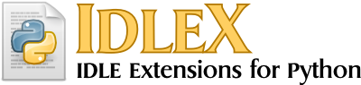

Version 1.22.3 released by MisterJFromLatvia
============================================

Released 2024-11-22

This release is developed with and tested with Python 3.10 and Python 3.13

Use this version only if original version no longer works (it is expected that original version of IDLEX does not work on Python 3.10 and above). I am releasing the update for IDLEX because the original IDLEX did not work with Python 3.10.4 (errors originating from IDLE library, fixed) and Python 3.13.0 (pip refusing to acknowledge idlex existence, fixed) on my system.

Updated installation instructions
=================================

It might be required to update setuptools first.

    scripts\pip install setuptools

Change directory to this repository before running the following command. You can skip this step if you do no want to build idlex-1.22.3.tar.gz required for installation yourself, I have included this file in this repository.

    python setup.py sdist

Now change directory to your python installation (internet connection is needed). If you do installation this way, you can simply uninstall IDLEX with scripts\pip uninstall idlex .

    scripts\pip install idlex-1.22.3.tar.gz

Update 1.22.3 footnote from developer
=====================================

"Ooooooh, I never seen this feature before on IDLE. So that's how it's supposed to work."

Original README.md below
========================

==================================

Version 1.22 - released 2022-01-15

IdleX works with Python 3.4+.

Its website and download information can be found at: http://idlex.sourceforge.net

Installing IdleX
================

This is optional. You may run idlex.py directly without installing.

    python setup.py install --user

Running IdleX
=============

If IdleX is installed, you can launch it with:

    python -m idlexlib.launch

On Windows:
1) Extract the contents of the idlex-x.x.zip file.
2) Double-click "idlex.py" to launch IdleX.
3) Run "scripts/EditWithIdleX.py" if you want 'Edit with IdleX' in the right-click context menu.

On Linux/MacOS:
1) Open a terminal.
2) Change into the idlex directory.
3) Run: `$ python idlex.py`

Demos
=====

The "demos" directory has several .py files that detail the
functionality of some of these extensions.

Acknowledgements
================

Acknowledgements may be found in idlexlib/ACKS.txt

History
=======

IdleX started as a set of extensions in 2008, beginning with my first Python
patch: [issue2704](https://bugs.python.org/issue2704) (which is still open).
I packaged and released a set of extensions in 2011, working on top of IDLE
that shipped with Python 2.6 and 3.2.

[PEP434](https://www.python.org/dev/peps/pep-0434/) allowed for IDLE to receive
updates without the strict requirements of a standard library module.
Python 3.6 contained a patch which renamed the internals of `idlelib` (see [issue24225](https://bugs.python.org/issue24225)), which required IdleX to become a fork from the 3.5 branch.
